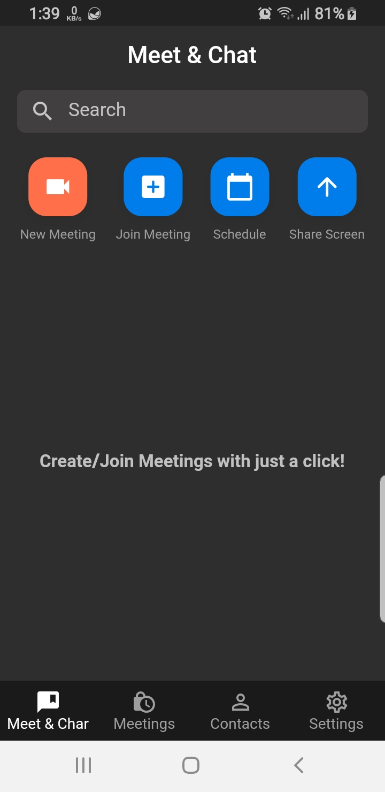
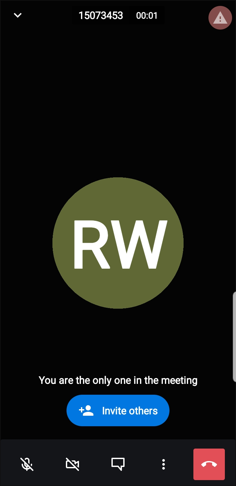
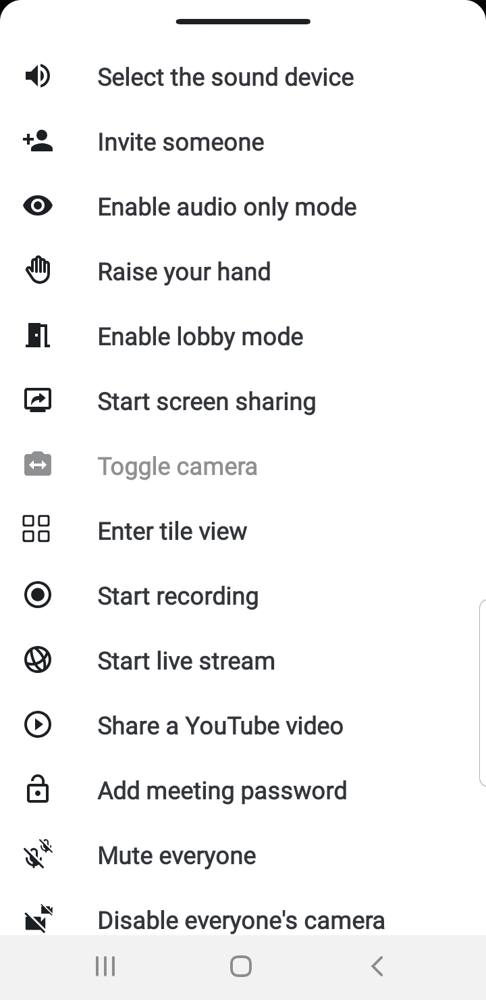
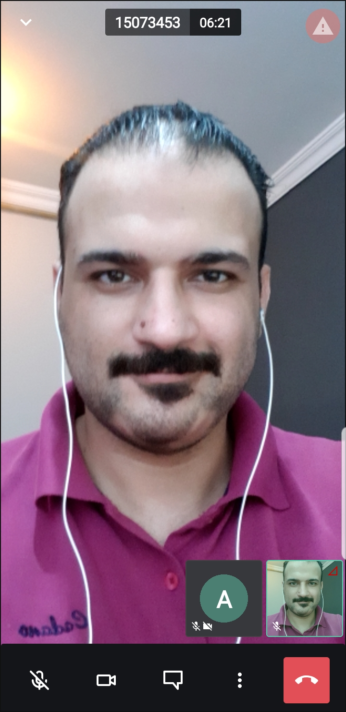
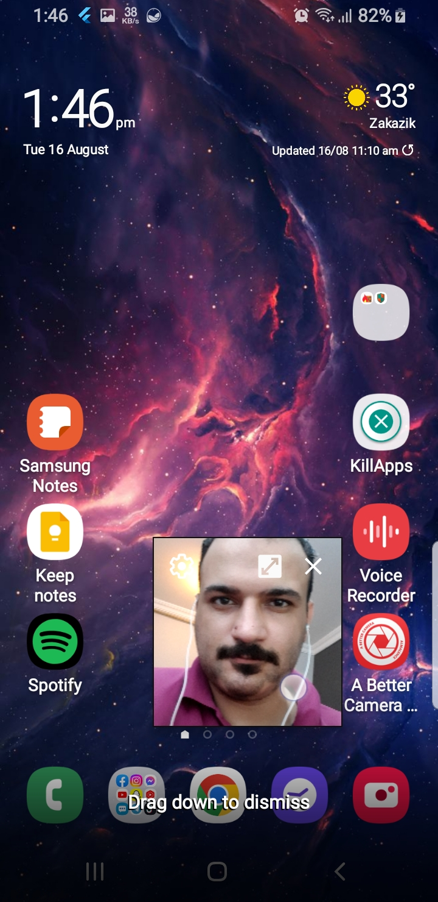

# zoom_colne_with_jitsi

##### In this tutorial, you will learn how to use Firebase to 
- Auth users with Google Sign In using Firebase 
- save user data to Firestore 
- show a stream of this data on your app (live data)
- create a nested collection -  
- log a user out 

#### Watch The Tutoial 👉🏻 https://youtu.be/tWraEokVD_k

## See Screenshots

<table>
  <tr>
    <td></td>
     <td></td>
     <td></td>
  </tr>
  <tr>
    <td>
    <td></td>
    <td></td>
  </tr>
   
  <tr>
    <td>
    <td>
  </tr>
  
 </table>
